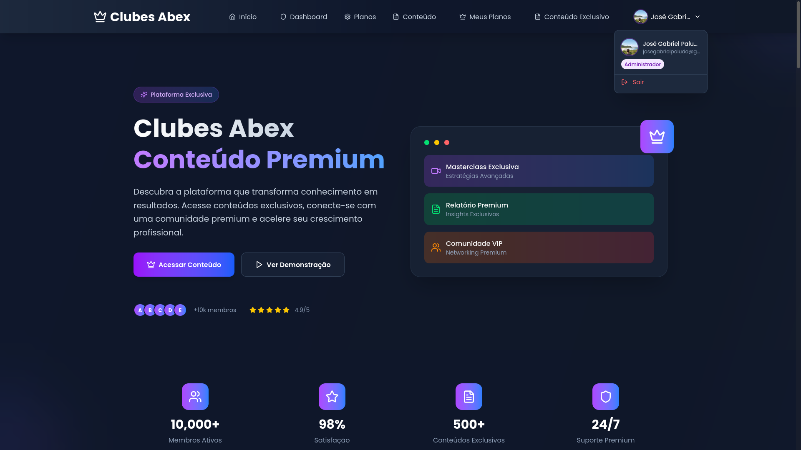

# 🚀 Clubes Abex - Subscription & Premium Content Management Platform



## ✨ Overview & Innovative Efficiency

**Clubes Abex** is a robust and intuitive administrative platform, designed to streamline the complete management of subscription clubs, members, and exclusive content. This project not only demonstrates a functional system with an impeccable user experience but also highlights **accelerated development capabilities** using modern technologies and efficient methodologies.

## 🎯 Key Highlights & Added Value

* **Rapid MVP Delivery:** Ideal for startups and businesses needing to validate ideas or launch products quickly.
* **Centralized Management:** Full control over users, subscription plans, and content catalog from a single dashboard.
* **Actionable Insights:** Real-time metrics dashboard for strategic decision-making on your club's performance.
* **Premium User Experience (UX):** Modern, responsive, and intuitive interface ensuring fluid navigation on any device.
* **Ready for Scalability:** Built with cutting-edge technologies to support your business's growth.

## 🌟 Core Features

The Clubes Abex system offers a comprehensive set of tools for efficient management:

* **Administrative Panel (Dashboard):**
    * Consolidated view of key indicators: total users, active subscriptions, plans, and total content.
    * Dynamic charts to monitor monthly revenue and conversion rates.
    * Quick actions for essential management tasks.
* **User Management:**
    * Create, Read, Update, and Delete (CRUD) operations for member and administrator profiles.
    * **Secure Authentication via Google OAuth:** Enables simplified and efficient user registration and login.
    * Session management and authentication-protected routes.
* **Subscription Plan Management:**
    * Complete CRUD for creating and managing different plan tiers (e.g., "Fiel S07", "Craque do Campo", "Torcida Unida").
    * Detailed configuration of pricing, periodicity, and included benefits for each plan.
* **Exclusive Content Management:**
    * CRUD for adding, listing, editing, and removing various content types (Masterclasses, Reports, Community Content).
    * Content categorization (Premium, Free).
    * Organized and accessible content library with search filters.
* **Controlled Access:**
    * Ensures that premium features and content are accessible only to authenticated users with corresponding active subscription plans.

## 🛠️ Technologies Utilized

This project was developed using a robust technology stack aligned with current market demands:

* **Frontend & Framework:**
    * [**Next.js**](https://nextjs.org/) (with React.js) - For Server-Side Rendering (SSR) and Static Site Generation (SSG), ensuring high performance and SEO.
    * **TypeScript** - For enhanced code safety and scalability.
    * **Tailwind CSS** - For rapid, responsive, and highly customizable styling.
* **Backend & Database:**
    * **Next.js API Routes** - As a lightweight and efficient backend for CRUD operations.
    * [**MongoDB Atlas**](https://www.mongodb.com/atlas) - Flexible and scalable NoSQL database for data persistence.
    * [**Mongoose**](https://mongoosejs.com/) - ODM (Object Data Modeling) for simplified interaction with MongoDB.
* **Authentication:**
    * **Google OAuth 2.0** - Direct integration for a modern and secure login system.
* **Deployment & Hosting:**
    * [**Vercel**](https://vercel.com/) - Continuous deployment platform, optimized for Next.js, ensuring agility and scalability.

## 🚀 Live Demo

Explore Clubes Abex in action and see the interface live:

[**Access the Clubes Abex Demo Here!**](https://projeto-assinaturas-abex.vercel.app/)

## ⚙️ How to Run the Project Locally

Follow these steps to set up and run the project on your local machine:

### Prerequisites

Make sure you have the following tools installed:

* Node.js (version 18.x or higher recommended)
* npm (Node Package Manager) or Yarn
* Git
* A [MongoDB Atlas](https://www.mongodb.com/atlas) account with a cluster and connection string.
* Google OAuth 2.0 API credentials (Client ID and Client Secret) configured in [Google Cloud Console](https://console.cloud.google.com/).

### Installation

1.  **Clone the repository:**
    ```bash
    git clone [https://github.com/jose-gp21/projeto-assinaturas-abex.git](https://github.com/jose-gp21/projeto-assinaturas-abex.git)
    cd projeto-assinaturas-abex
    ```
2.  **Install dependencies:**
    ```bash
    npm install
    # or
    yarn install
    ```
3.  **Configure environment variables:**
    * Create a `.env.local` file in the project's root.
    * Add the following variables (replace with your actual values):
        ```env
        MONGODB_URI=your_mongodb_atlas_connection_string
        MONGODB_DB_NAME=your_database_name
        GOOGLE_CLIENT_ID=your_google_client_id
        GOOGLE_CLIENT_SECRET=your_google_client_secret
        NEXTAUTH_URL=http://localhost:3000 # For local development
        NEXTAUTH_SECRET=your_random_nextauth_secret # Generate a long random string
        ```
    * *(Remember to configure Google OAuth callback URLs in Google Cloud Console: `http://localhost:3000/api/auth/callback/google` for development, and your Vercel production URL for deployment.)*

4.  **Run the project:**
    ```bash
    npm run dev
    # or
    yarn dev
    ```

The application will be accessible at `http://localhost:3000`.

---


## 📧 Contact

For questions, collaborations, or development opportunities, feel free to get in touch:

* **José Gabriel:** [github.com/jose-gp21](https://github.com/jose-gp21)
* **Email:** `gabrielpaludo@unochapeco.edu.br`
* **LinkedIn:** [José Gabriel](https://www.linkedin.com/in/jos%C3%A9-gabriel-paludo-131906267/)

---
